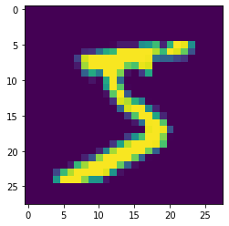
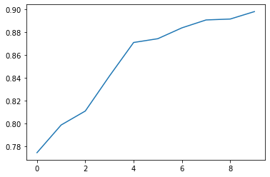

# TensorFlowd的基础使用

## Tensorflow基本概念
 - 使用图（graphs）来表示计算任务
 - 在被称之为会话（Session）的上下文（context）中执行图
 - 使用tensor表示数据
 - 通过变量（Variable）维护状态
 - 使用feed和fetch可以为任意的操作赋值或者从其中获取数据

Tensorflow是一个编程系统，使用图（graphs）来表示计算任务，图（graphs）中的节点称之为op（operation），一个op获得0个或多个Tensor，执行计算，产生0个或多个Tensor。Tensor看作是一个n维的数组或列表。图必须在会话（Session）里被启动。

## Tensorflow结构


## 创建图，启动图


```python
# import tensorflow as tf
import tensorflow.compat.v1 as tf #兼容tensorflow 1.X
tf.disable_v2_behavior()
import numpy as np
```


```python
m1 = np.array([3,3],ndmin = 2)
print(m1)
m2 = np.array([2,3])
m2.shape = (2,1)
print(m2)
#创建一个常量op
m1 = tf.constant(m1)
#创建一个常量op
m2 = tf.constant(m2)
#创建一个矩阵乘法op，把m1和m2传入
product = tf.matmul(m1,m2)
print(product)
```

    [[3 3]]
    [[2]
     [3]]
    Tensor("MatMul_2:0", shape=(1, 1), dtype=int32)


```python
#定义一个会话，启动默认图，这里是tf 1.X的功能，2.X不需要
sess = tf1.Session()
#调用sess的run方法来执行矩阵乘法op
#run(product)触发了图中3个op
result = sess.run(product)
print(result)
sess.close()
```

    [[15]]


```python
with tf.Session() as sess:
    result = sess.run(product)
    print(result)
```

    [[15]]


## 变量


```python
# tf 1.x
import tensorflow.compat.v1 as tf #兼容tensorflow 1.X
tf.disable_v2_behavior()
```


```python
x = tf.Variable([1,2])
a = tf.constant([3,3])

#增加一个减法op
sub = tf.subtract(x,a)
#增加一个加法op
add = tf.add(x,sub)

#变量初始化
init = tf.global_variables_initializer()

with tf.Session() as sess:
    sess.run(init)
    print(sess.run(sub))
    print(sess.run(add))
```

    [-2 -1]
    [-1  1]


```python
#创建一个变量初始化为0
state = tf.Variable(0,name = 'counter')
#创建一个op,作用是使state加1
new_value = tf.add(state,1)
#赋值op
update = tf.assign(state,new_value)
#变量初始化
init = tf.global_variables_initializer()

with tf.Session() as sess:
    sess.run(init)
    print(sess.run(state))
    for _ in range(5):
        sess.run(update)
        print(sess.run(state),end = ',')
```

    0
    1,2,3,4,5,

### 2.x


```python
# tf 2.x
import tensorflow as tf
```


```python
x = tf.Variable([1,2])
a = tf.constant([3,3])

#增加一个减法op
sub = tf.subtract(x,a)
#增加一个加法op
add = tf.add(x,sub)
print(sub)
print(add)
#变量初始化
# init = tf.global_variables_initializer()

# with tf.Session() as sess:
#     sess.run(init)
#     print(sess.run(sub))
#     print(sess.run(add))
```

    Tensor("Sub_9:0", shape=(2,), dtype=int32)
    Tensor("Add_13:0", shape=(2,), dtype=int32)


## Fetch and Feed


```python
# tf 1.x
import tensorflow.compat.v1 as tf #兼容tensorflow 1.X
tf.disable_v2_behavior()
```


```python
# Fetch
input1 = tf.constant(3.0)
input2 = tf.constant(2.0)
input3 = tf.constant(5.0)

add = tf.add(input2,input3)
mul = tf.multiply(input1,add)

with tf.Session() as sess:
    result = sess.run([mul,add])
    print(result)
```

    [21.0, 7.0]


```python
#Feed
input1 = tf.placeholder(tf.float32)
input2 = tf.placeholder(tf.float32)

output = tf.multiply(input1,input2)

with tf.Session() as sess:
    #feed的数据以字典的形式传入
    print(sess.run(output,feed_dict = {input1:[7.],input2:[2,]}))
```

    [14.]


## Tensorflow 简单示例 一元线性回归


```python
# tf 1.x
import tensorflow.compat.v1 as tf #兼容tensorflow 1.X
tf.disable_v2_behavior()
import numpy as np
```


```python
# x_data = np.random.rand(100)

# y_data = x_data*0.1+0.2

x_data = np.array([3.4,1.8,4.6,2.3,3.1,5.5,0.7,3,2.6,4.3,2.1,1.1,6.1,4.8,3.8,4.1,5.1,4.7,5.8,5.9])
y_data = np.array([26.2,17.8,31.3,23.1,27.5,36,14.1,22.3,19.6,21.3,24,17.3,43.2,36.4,26.1,15,41.5,16.2,24,41])
print(x_data)
print(y_data)
#构造一个线性模型
b = tf.Variable(0.)
k = tf.Variable(0.)
y = k * x_data + b

#二次代价函数
loss = tf.reduce_mean(tf.square(y_data-y))

#定义一个梯度下降法来进行训练的优化器
optimizer = tf.train.GradientDescentOptimizer(0.01)
#最小化代价函数
train = optimizer.minimize(loss)

init = tf.global_variables_initializer()

with tf.Session() as sess:
    sess.run(init)
    for step in range(10001):
        sess.run(train)
        if step%100 == 0:
            print(step,sess.run([k,b]))
```

    [3.4 1.8 4.6 2.3 3.1 5.5 0.7 3.  2.6 4.3 2.1 1.1 6.1 4.8 3.8 4.1 5.1 4.7
     5.8 5.9]
    [26.2 17.8 31.3 23.1 27.5 36.  14.1 22.3 19.6 21.3 24.  17.3 43.2 36.4
     26.1 15.  41.5 16.2 24.  41. ]
    0 [2.15804, 0.5239]
    100 [5.6763434, 3.9092102]
    200 [5.2553234, 5.747787]
    300 [4.939517, 7.126901]
    400 [4.702631, 8.161373]
    500 [4.5249434, 8.937327]
    600 [4.3916597, 9.519371]
    700 [4.2916846, 9.95596]
    800 [4.216693, 10.283444]
    900 [4.1604424, 10.529089]
    1000 [4.118248, 10.71335]
    1100 [4.086599, 10.851561]
    1200 [4.0628595, 10.95523]
    1300 [4.0450516, 11.032994]
    1400 [4.031694, 11.091328]
    1500 [4.021674, 11.135083]
    1600 [4.0141587, 11.167903]
    1700 [4.0085216, 11.192521]
    1800 [4.0042934, 11.210984]
    1900 [4.001122, 11.224834]
    2000 [3.9987428, 11.235224]
    2100 [3.9969583, 11.243017]
    2200 [3.9956203, 11.24886]
    2300 [3.994616, 11.253246]
    2400 [3.9938629, 11.256536]
    2500 [3.9932976, 11.259003]
    2600 [3.9928744, 11.260852]
    2700 [3.9925563, 11.262241]
    2800 [3.9923174, 11.263283]
    2900 [3.9921398, 11.264059]
    3000 [3.9920053, 11.264646]
    3100 [3.9919057, 11.265081]
    3200 [3.9918306, 11.265409]
    3300 [3.9917736, 11.265657]
    3400 [3.9917302, 11.265848]
    3500 [3.9917004, 11.265977]
    3600 [3.9916787, 11.266072]
    3700 [3.991657, 11.266168]
    3800 [3.991639, 11.266247]
    3900 [3.991639, 11.266247]
    4000 [3.991639, 11.266247]
    4100 [3.991639, 11.266247]
    4200 [3.991639, 11.266247]
    4300 [3.991639, 11.266247]
    4400 [3.991639, 11.266247]
    4500 [3.991639, 11.266247]
    4600 [3.991639, 11.266247]
    4700 [3.991639, 11.266247]
    4800 [3.991639, 11.266247]
    4900 [3.991639, 11.266247]
    5000 [3.991639, 11.266247]
    5100 [3.991639, 11.266247]
    5200 [3.991639, 11.266247]
    5300 [3.991639, 11.266247]
    5400 [3.991639, 11.266247]
    5500 [3.991639, 11.266247]
    5600 [3.991639, 11.266247]
    5700 [3.991639, 11.266247]
    5800 [3.991639, 11.266247]
    5900 [3.991639, 11.266247]
    6000 [3.991639, 11.266247]
    6100 [3.991639, 11.266247]
    6200 [3.991639, 11.266247]
    6300 [3.991639, 11.266247]
    6400 [3.991639, 11.266247]
    6500 [3.991639, 11.266247]
    6600 [3.991639, 11.266247]
    6700 [3.991639, 11.266247]
    6800 [3.991639, 11.266247]
    6900 [3.991639, 11.266247]
    7000 [3.991639, 11.266247]
    7100 [3.991639, 11.266247]
    7200 [3.991639, 11.266247]
    7300 [3.991639, 11.266247]
    7400 [3.991639, 11.266247]
    7500 [3.991639, 11.266247]
    7600 [3.991639, 11.266247]
    7700 [3.991639, 11.266247]
    7800 [3.991639, 11.266247]
    7900 [3.991639, 11.266247]
    8000 [3.991639, 11.266247]
    8100 [3.991639, 11.266247]
    8200 [3.991639, 11.266247]
    8300 [3.991639, 11.266247]
    8400 [3.991639, 11.266247]
    8500 [3.991639, 11.266247]
    8600 [3.991639, 11.266247]
    8700 [3.991639, 11.266247]
    8800 [3.991639, 11.266247]
    8900 [3.991639, 11.266247]
    9000 [3.991639, 11.266247]
    9100 [3.991639, 11.266247]
    9200 [3.991639, 11.266247]
    9300 [3.991639, 11.266247]
    9400 [3.991639, 11.266247]
    9500 [3.991639, 11.266247]
    9600 [3.991639, 11.266247]
    9700 [3.991639, 11.266247]
    9800 [3.991639, 11.266247]
    9900 [3.991639, 11.266247]
    10000 [3.991639, 11.266247]


# 非线性回归


```python
# tf 1.x
import tensorflow.compat.v1 as tf #兼容tensorflow 1.X
tf.disable_v2_behavior()
import numpy as np
import matplotlib.pyplot as plt
from tqdm import tqdm
```


```python
#使用numpy生成200个随机点
x_data = np.linspace(-0.5,0.5,200).reshape(200,1)
# x_data = np.linspace(-0.5,0.5,200)[:,np.newaxis]
# print(x_data)
noise = np.random.normal(0,0.02,x_data.shape)
y_data = np.square(x_data) + noise


#定义两个placeholder
x = tf.placeholder(tf.float32,[None,1])
y = tf.placeholder(tf.float32,[None,1])


#定义神经网络中间层
Weights_L1 = tf.Variable(tf.random.normal([1,10]))
biases_L1 = tf.Variable(tf.zeros([1,10]))
Wx_plus_b_L1 = tf.matmul(x,Weights_L1) + biases_L1
L1 = tf.nn.tanh(Wx_plus_b_L1)


#定义神经网络输出层
Weights_L2 = tf.Variable(tf.random.normal([10,1]))
biases_L2 = tf.Variable(tf.zeros([1,1]))
Wx_plus_b_L2 = tf.matmul(L1,Weights_L2) + biases_L2
prediction = tf.nn.tanh(Wx_plus_b_L2)


#二次代价函数
loss = tf.reduce_mean(tf.square(y-prediction))
#使用梯度下降法训练
train_step = tf.train.GradientDescentOptimizer(0.1).minimize(loss)

with tf.Session() as sess:
    #变量初始化
    sess.run(tf.global_variables_initializer())
    for i in tqdm(range(5000)):
        sess.run(train_step,feed_dict = {x:x_data,y:y_data})
    
    #获得预测值
    prediction_value = sess.run(prediction,feed_dict = {x:x_data})
    #绘图
    plt.figure()
    plt.scatter(x_data,y_data)
    plt.plot(x_data,prediction_value,'r-',lw = 5)
    plt.show()
```

    100%|████████████████████████████████████████████████████████████████████████████| 5000/5000 [00:02<00:00, 2150.88it/s]


    


# 手写数字识别

## MNIST数据集


## 神经网络构建


## Softmax函数


## 代码实现（简单版本）


```python
# tf 1.x
import tensorflow.compat.v1 as tf #兼容tensorflow 1.X
tf.disable_v2_behavior()
import numpy as np
import matplotlib.pyplot as plt
from tqdm import tqdm
```

    WARNING:tensorflow:From D:\DEV\ANACONDA\envs\tensorflow\lib\site-packages\tensorflow\python\compat\v2_compat.py:107: disable_resource_variables (from tensorflow.python.ops.variable_scope) is deprecated and will be removed in a future version.
    Instructions for updating:
    non-resource variables are not supported in the long term


```python
mnist = tf.keras.datasets.mnist
(x_train, y_train), (x_test, y_test) = mnist.load_data()
print(x_train.shape)
print(x_test.shape)
plt.figure()
plt.imshow(x_train[0])
print(y_train[0])
```

    (60000, 28, 28)
    (10000, 28, 28)
    5



    


```python
x_train.shape = (60000,784)
x_test.shape = (10000,784)
y_train.shape = (60000,1)
y_test.shape = (10000,1)
# print(x_train.shape)
# print(x_test.shape)
# print(x_train[0])
```


```python
y_train_list = []
for y in y_train:
    hot = np.zeros(10)
    hot[y] = 1
    y_train_list.append(hot)

y_test_list = []
for y in y_test:
    hot = np.zeros(10)
    hot[y] = 1
    y_test_list.append(hot)
    
y_train = np.asarray(y_train_list)
y_test = np.asarray(y_test_list)
print(y_train[0])
```

    [0. 0. 0. 0. 0. 1. 0. 0. 0. 0.]


```python

```


```python
print(y_train.shape)
print(x_test.shape)
```

    (60000, 10)
    (10000, 784)


```python
#每个批次的大小
batch_size = 2000
#计算一共有多少个批次
n_batch = len(x_train)//batch_size
# print(n_batch)
#定义两个placeholder
x = tf.placeholder(tf.float32,[None,784])
y = tf.placeholder(tf.float32,[None,10])

#创建一个简单的神经网络
w1 = tf.Variable(tf.zeros([784,10]))
# w2 = tf.Variable(tf.random_normal([784,10]))
# w3 = tf.Variable(tf.random_normal([784,10]))
b = tf.Variable(tf.zeros([10]))
prediction = tf.nn.softmax(tf.matmul(x,w1)+b)

#二次代价函数
#loss = tf.reduce_mean(tf.square(y-prediction))
#交叉熵代价函数
loss = tf.reduce_mean(tf.nn.softmax_cross_entropy_with_logits(labels = y,logits = prediction))
# loss=tf.reduce_mean(tf.nn.softmax_cross_entropy_with_logits(labels=y, logits=prediction))
#使用梯度下降法
train_step = tf.train.GradientDescentOptimizer(0.1).minimize(loss)

#初始化变量
init = tf.global_variables_initializer()

#结果存放在一个布尔型列表中
correct_prediction = tf.equal(tf.argmax(y,1),tf.argmax(prediction,1))#argmax返回一维向量中最大值所在的位置
#求准确率
accuracy = tf.reduce_mean(tf.cast(correct_prediction,tf.float32))

# with tf.Session() as sess:
#     sess.run(init)
#     for epoch in range(21):
#         for batch in range(n_batch):
            
#             batch_xs,batch_ys = x_train[batch:(batch+1)*batch_size],y_train[batch:(batch+1)]
#             sess.run(train_step,feed_dict = {x:batch_xs,y:batch_ys})
        
#         acc = sess.run(accuracy,feed_dict = {x:x_test,y:y_test})
#         print("iter {} :Testing Accuracy is {}".format(epoch,acc))
#训练次数
epochs = 100
accuracys = []
with tf.Session() as sess:
    sess.run(init)
    for epoch in range(epochs):
        for batch in range(n_batch):
            batch_xs = x_train[batch*batch_size:(batch+1)*batch_size]
            batch_ys = y_train[batch*batch_size:(batch+1)*batch_size]
            sess.run(train_step,feed_dict = {x:batch_xs,y:batch_ys})
            
        acc = sess.run(accuracy,feed_dict = {x:x_test,y:y_test})
        accuracys.append(acc)
        print("iter {} :Testing Accuracy is {}".format(epoch,acc))
plt.figure()
plt.plot(accuracys)
plt.show()
```

    iter 0 :Testing Accuracy is 0.7921000123023987
    iter 1 :Testing Accuracy is 0.8051000237464905
    iter 2 :Testing Accuracy is 0.8123999834060669
    iter 3 :Testing Accuracy is 0.8134999871253967
    iter 4 :Testing Accuracy is 0.8256999850273132
    iter 5 :Testing Accuracy is 0.8276000022888184
    iter 6 :Testing Accuracy is 0.8205000162124634
    iter 7 :Testing Accuracy is 0.8255000114440918
    iter 8 :Testing Accuracy is 0.8273000121116638
    iter 9 :Testing Accuracy is 0.83160001039505
    iter 10 :Testing Accuracy is 0.8306999802589417
    iter 11 :Testing Accuracy is 0.8471999764442444
    iter 12 :Testing Accuracy is 0.8898000121116638
    iter 13 :Testing Accuracy is 0.8949000239372253
    iter 14 :Testing Accuracy is 0.9020000100135803
    iter 15 :Testing Accuracy is 0.9041000008583069
    iter 16 :Testing Accuracy is 0.9057000279426575
    iter 17 :Testing Accuracy is 0.9034000039100647
    iter 18 :Testing Accuracy is 0.902999997138977
    iter 19 :Testing Accuracy is 0.8978999853134155
    iter 20 :Testing Accuracy is 0.8974999785423279
    iter 21 :Testing Accuracy is 0.9067999720573425
    iter 22 :Testing Accuracy is 0.9097999930381775
    iter 23 :Testing Accuracy is 0.9016000032424927
    iter 24 :Testing Accuracy is 0.9075999855995178
    iter 25 :Testing Accuracy is 0.9118000268936157
    iter 26 :Testing Accuracy is 0.9132999777793884
    iter 27 :Testing Accuracy is 0.9118000268936157
    iter 28 :Testing Accuracy is 0.9117000102996826
    iter 29 :Testing Accuracy is 0.9143999814987183
    iter 30 :Testing Accuracy is 0.9143000245094299
    iter 31 :Testing Accuracy is 0.9144999980926514
    iter 32 :Testing Accuracy is 0.9129999876022339
    iter 33 :Testing Accuracy is 0.9133999943733215
    iter 34 :Testing Accuracy is 0.9154999852180481
    iter 35 :Testing Accuracy is 0.914900004863739
    iter 36 :Testing Accuracy is 0.9143000245094299
    iter 37 :Testing Accuracy is 0.916700005531311
    iter 38 :Testing Accuracy is 0.9082000255584717
    iter 39 :Testing Accuracy is 0.9150999784469604
    iter 40 :Testing Accuracy is 0.911300003528595
    iter 41 :Testing Accuracy is 0.9156000018119812
    iter 42 :Testing Accuracy is 0.9090999960899353
    iter 43 :Testing Accuracy is 0.9186999797821045
    iter 44 :Testing Accuracy is 0.9208999872207642
    iter 45 :Testing Accuracy is 0.9125000238418579
    iter 46 :Testing Accuracy is 0.9133999943733215
    iter 47 :Testing Accuracy is 0.9182999730110168
    iter 48 :Testing Accuracy is 0.911899983882904
    iter 49 :Testing Accuracy is 0.9096999764442444
    iter 50 :Testing Accuracy is 0.9186999797821045
    iter 51 :Testing Accuracy is 0.9203000068664551
    iter 52 :Testing Accuracy is 0.9190999865531921
    iter 53 :Testing Accuracy is 0.9172999858856201
    iter 54 :Testing Accuracy is 0.9194999933242798
    iter 55 :Testing Accuracy is 0.9176999926567078
    iter 56 :Testing Accuracy is 0.9160000085830688
    iter 57 :Testing Accuracy is 0.9161999821662903
    iter 58 :Testing Accuracy is 0.9128000140190125
    iter 59 :Testing Accuracy is 0.9089999794960022
    iter 60 :Testing Accuracy is 0.9133999943733215
    iter 61 :Testing Accuracy is 0.9196000099182129
    iter 62 :Testing Accuracy is 0.9169999957084656
    iter 63 :Testing Accuracy is 0.9193000197410583
    iter 64 :Testing Accuracy is 0.919700026512146
    iter 65 :Testing Accuracy is 0.9193999767303467
    iter 66 :Testing Accuracy is 0.9200999736785889
    iter 67 :Testing Accuracy is 0.9240999817848206
    iter 68 :Testing Accuracy is 0.9171000123023987
    iter 69 :Testing Accuracy is 0.9157000184059143
    iter 70 :Testing Accuracy is 0.9168999791145325
    iter 71 :Testing Accuracy is 0.9164000153541565
    iter 72 :Testing Accuracy is 0.9193000197410583
    iter 73 :Testing Accuracy is 0.9147999882698059
    iter 74 :Testing Accuracy is 0.9165999889373779
    iter 75 :Testing Accuracy is 0.9186999797821045
    iter 76 :Testing Accuracy is 0.916100025177002
    iter 77 :Testing Accuracy is 0.9193000197410583
    iter 78 :Testing Accuracy is 0.9138000011444092
    iter 79 :Testing Accuracy is 0.9199000000953674
    iter 80 :Testing Accuracy is 0.916100025177002
    iter 81 :Testing Accuracy is 0.9157999753952026
    iter 82 :Testing Accuracy is 0.9110000133514404
    iter 83 :Testing Accuracy is 0.9136000275611877
    iter 84 :Testing Accuracy is 0.9174000024795532
    iter 85 :Testing Accuracy is 0.920199990272522
    iter 86 :Testing Accuracy is 0.9182999730110168
    iter 87 :Testing Accuracy is 0.9190000295639038
    iter 88 :Testing Accuracy is 0.9204000234603882
    iter 89 :Testing Accuracy is 0.9243000149726868
    iter 90 :Testing Accuracy is 0.900600016117096
    iter 91 :Testing Accuracy is 0.9172000288963318
    iter 92 :Testing Accuracy is 0.9156000018119812
    iter 93 :Testing Accuracy is 0.9190000295639038
    iter 94 :Testing Accuracy is 0.9171000123023987
    iter 95 :Testing Accuracy is 0.9194999933242798
    iter 96 :Testing Accuracy is 0.919700026512146
    iter 97 :Testing Accuracy is 0.9204000234603882
    iter 98 :Testing Accuracy is 0.9225000143051147
    iter 99 :Testing Accuracy is 0.9189000129699707


    


**二次代价函数**
iter 0 :Testing Accuracy is 0.8036999702453613
iter 1 :Testing Accuracy is 0.8241999745368958
iter 2 :Testing Accuracy is 0.8328999876976013
iter 3 :Testing Accuracy is 0.8748000264167786
iter 4 :Testing Accuracy is 0.8895999789237976
iter 5 :Testing Accuracy is 0.8959000110626221
iter 6 :Testing Accuracy is 0.9047999978065491
iter 7 :Testing Accuracy is 0.9061999917030334
iter 8 :Testing Accuracy is 0.9047999978065491
iter 9 :Testing Accuracy is 0.9041000008583069
iter 10 :Testing Accuracy is 0.9165999889373779
iter 11 :Testing Accuracy is 0.9093000292778015
iter 12 :Testing Accuracy is 0.907800018787384
iter 13 :Testing Accuracy is 0.9120000004768372
iter 14 :Testing Accuracy is 0.9122999906539917
iter 15 :Testing Accuracy is 0.9128000140190125
iter 16 :Testing Accuracy is 0.8986999988555908
iter 17 :Testing Accuracy is 0.9007999897003174
iter 18 :Testing Accuracy is 0.9122999906539917
iter 19 :Testing Accuracy is 0.9142000079154968
iter 20 :Testing Accuracy is 0.9108999967575073
iter 21 :Testing Accuracy is 0.9162999987602234
iter 22 :Testing Accuracy is 0.9175000190734863
iter 23 :Testing Accuracy is 0.9174000024795532
iter 24 :Testing Accuracy is 0.9178000092506409
iter 25 :Testing Accuracy is 0.919700026512146
iter 26 :Testing Accuracy is 0.9118000268936157
iter 27 :Testing Accuracy is 0.9182000160217285
iter 28 :Testing Accuracy is 0.9200000166893005
iter 29 :Testing Accuracy is 0.9192000031471252
iter 30 :Testing Accuracy is 0.9200000166893005
iter 31 :Testing Accuracy is 0.9172000288963318
iter 32 :Testing Accuracy is 0.9186999797821045
iter 33 :Testing Accuracy is 0.9186999797821045
iter 34 :Testing Accuracy is 0.9174000024795532
iter 35 :Testing Accuracy is 0.9203000068664551
iter 36 :Testing Accuracy is 0.920199990272522
iter 37 :Testing Accuracy is 0.916100025177002
iter 38 :Testing Accuracy is 0.9165999889373779
iter 39 :Testing Accuracy is 0.917900025844574
iter 40 :Testing Accuracy is 0.9193000197410583
iter 41 :Testing Accuracy is 0.9156000018119812
iter 42 :Testing Accuracy is 0.9187999963760376
iter 43 :Testing Accuracy is 0.9196000099182129
iter 44 :Testing Accuracy is 0.9230999946594238
iter 45 :Testing Accuracy is 0.9157999753952026
iter 46 :Testing Accuracy is 0.917900025844574
iter 47 :Testing Accuracy is 0.9214000105857849
iter 48 :Testing Accuracy is 0.9187999963760376
iter 49 :Testing Accuracy is 0.9139000177383423
iter 50 :Testing Accuracy is 0.920799970626831
iter 51 :Testing Accuracy is 0.916700005531311
iter 52 :Testing Accuracy is 0.9211999773979187
iter 53 :Testing Accuracy is 0.9194999933242798
iter 54 :Testing Accuracy is 0.9225000143051147
iter 55 :Testing Accuracy is 0.9157000184059143
iter 56 :Testing Accuracy is 0.920199990272522
iter 57 :Testing Accuracy is 0.920799970626831
iter 58 :Testing Accuracy is 0.9207000136375427
iter 59 :Testing Accuracy is 0.9161999821662903
iter 60 :Testing Accuracy is 0.920799970626831
iter 61 :Testing Accuracy is 0.9229999780654907
iter 62 :Testing Accuracy is 0.9218999743461609
iter 63 :Testing Accuracy is 0.9233999848365784
iter 64 :Testing Accuracy is 0.9228000044822693
iter 65 :Testing Accuracy is 0.9185000061988831
iter 66 :Testing Accuracy is 0.9215999841690063
iter 67 :Testing Accuracy is 0.919700026512146
iter 68 :Testing Accuracy is 0.920199990272522
iter 69 :Testing Accuracy is 0.9228000044822693
iter 70 :Testing Accuracy is 0.9162999987602234
iter 71 :Testing Accuracy is 0.9176999926567078
iter 72 :Testing Accuracy is 0.9229000210762024
iter 73 :Testing Accuracy is 0.9259999990463257
iter 74 :Testing Accuracy is 0.9218000173568726
iter 75 :Testing Accuracy is 0.9248999953269958
iter 76 :Testing Accuracy is 0.9248999953269958
iter 77 :Testing Accuracy is 0.9176999926567078
iter 78 :Testing Accuracy is 0.9200999736785889
iter 79 :Testing Accuracy is 0.9218000173568726
iter 80 :Testing Accuracy is 0.9258999824523926
iter 81 :Testing Accuracy is 0.925599992275238
iter 82 :Testing Accuracy is 0.9243000149726868
iter 83 :Testing Accuracy is 0.9243999719619751
iter 84 :Testing Accuracy is 0.9218999743461609
iter 85 :Testing Accuracy is 0.9200999736785889
iter 86 :Testing Accuracy is 0.9225000143051147
iter 87 :Testing Accuracy is 0.9251999855041504
iter 88 :Testing Accuracy is 0.9261999726295471
iter 89 :Testing Accuracy is 0.9247000217437744
iter 90 :Testing Accuracy is 0.9230999946594238
iter 91 :Testing Accuracy is 0.9243000149726868
iter 92 :Testing Accuracy is 0.9223999977111816
iter 93 :Testing Accuracy is 0.9203000068664551
iter 94 :Testing Accuracy is 0.9243999719619751
iter 95 :Testing Accuracy is 0.9226999878883362
iter 96 :Testing Accuracy is 0.9222000241279602
iter 97 :Testing Accuracy is 0.9239000082015991
iter 98 :Testing Accuracy is 0.9243999719619751
iter 99 :Testing Accuracy is 0.9246000051498413


# 代价函数

## 二次代价函数（quadratic cost）


假设我们目标是收敛到1。A点为0.82离目标比较远，梯度比较大，权值调整比较大。B点为0.98离目标比较近，梯度比较小，权值调整比较小，调整方案合理。
假设我们目标是收敛到0。A点为0.82离目标比较近，梯度比较大，权值调整比较大。B点为0.98离目标比较远，梯度比较小，权值调整比较小，调整方案不合理。

## 交叉熵代价函数（Cross-entropy）


## 对数释然代价函数（log-likelihood cost）


# 拟合


## 防止过拟合
 - 增加数据集
 - 正则化方法           $C=C_0+\frac{\lambda}{2n}\sum_{\omega}\omega^2$
 - Dropout
 

## Dropout


```python
# tf 1.x
import tensorflow.compat.v1 as tf #兼容tensorflow 1.X
tf.disable_v2_behavior()
import numpy as np
import matplotlib.pyplot as plt
from tqdm import tqdm
mnist = tf.keras.datasets.mnist
(x_train, y_train), (x_test, y_test) = mnist.load_data()
# print(x_train.shape)
# print(x_test.shape)
# plt.figure()
# plt.imshow(x_train[0])
# print(y_train[0])
x_train.shape = (60000,784)
x_test.shape = (10000,784)
y_train.shape = (60000,1)
y_test.shape = (10000,1)
y_train_list = []
for y in y_train:
    hot = np.zeros(10)
    hot[y] = 1
    y_train_list.append(hot)

y_test_list = []
for y in y_test:
    hot = np.zeros(10)
    hot[y] = 1
    y_test_list.append(hot)
    
y_train = np.asarray(y_train_list)
y_test = np.asarray(y_test_list)
# print(y_train[0])
#每个批次的大小
batch_size = 2000
#计算一共有多少个批次
n_batch = len(x_train)//batch_size
# print(n_batch)
#定义两个placeholder
x = tf.placeholder(tf.float32,[None,784])
y = tf.placeholder(tf.float32,[None,10])
keep_prob = tf.placeholder(tf.float32)


#创建一个简单的神经网络

# w1 = tf.Variable(tf.zeros([784,10]))
# b = tf.Variable(tf.zeros([10]))

w1 = tf.Variable(tf.truncated_normal([784,200],stddev = 0.1))
b1 = tf.Variable(tf.zeros([200])+0.1)
L1 = tf.nn.tanh(tf.matmul(x,w1)+b1)
L1_drop = tf.nn.dropout(L1,keep_prob)

w2 = tf.Variable(tf.truncated_normal([200,200],stddev = 0.1))
b2 = tf.Variable(tf.zeros([200])+0.1)
L2 = tf.nn.tanh(tf.matmul(L1_drop,w2)+b2)
L2_drop = tf.nn.dropout(L2,keep_prob)

w3 = tf.Variable(tf.truncated_normal([200,100],stddev = 0.1))
b3 = tf.Variable(tf.zeros([100])+0.1)
L3 = tf.nn.tanh(tf.matmul(L2_drop,w3)+b3)
L3_drop = tf.nn.dropout(L3,keep_prob)

w4 = tf.Variable(tf.truncated_normal([100,10],stddev = 0.1))
b4 = tf.Variable(tf.zeros([10])+0.1)
prediction = tf.nn.softmax(tf.matmul(L3_drop,w4)+b4)

#二次代价函数
#loss = tf.reduce_mean(tf.square(y-prediction))
#交叉熵代价函数
loss = tf.reduce_mean(tf.nn.softmax_cross_entropy_with_logits(labels = y,logits = prediction))
# loss=tf.reduce_mean(tf.nn.softmax_cross_entropy_with_logits(labels=y, logits=prediction))
#使用梯度下降法
train_step = tf.train.GradientDescentOptimizer(0.1).minimize(loss)

#初始化变量
init = tf.global_variables_initializer()

#结果存放在一个布尔型列表中
correct_prediction = tf.equal(tf.argmax(y,1),tf.argmax(prediction,1))#argmax返回一维向量中最大值所在的位置
#求准确率
accuracy = tf.reduce_mean(tf.cast(correct_prediction,tf.float32))

# with tf.Session() as sess:
#     sess.run(init)
#     for epoch in range(21):
#         for batch in range(n_batch):
            
#             batch_xs,batch_ys = x_train[batch:(batch+1)*batch_size],y_train[batch:(batch+1)]
#             sess.run(train_step,feed_dict = {x:batch_xs,y:batch_ys})
        
#         acc = sess.run(accuracy,feed_dict = {x:x_test,y:y_test})
#         print("iter {} :Testing Accuracy is {}".format(epoch,acc))
#训练次数
epochs = 31
test_accuracys = []
train_accuracys = []
with tf.Session() as sess:
    sess.run(init)
    for epoch in range(epochs):
        for batch in range(n_batch):
            batch_xs = x_train[batch*batch_size:(batch+1)*batch_size]
            batch_ys = y_train[batch*batch_size:(batch+1)*batch_size]
            sess.run(train_step,feed_dict = {x:batch_xs,y:batch_ys,keep_prob:0.7})
            
        test_acc = sess.run(accuracy,feed_dict = {x:x_test,y:y_test,keep_prob:1.0})
        train_acc = sess.run(accuracy,feed_dict = {x:x_train,y:y_train,keep_prob:1.0})
        test_accuracys.append(test_acc)
        train_accuracys.append(train_acc)
        print("iter {} :Testing Accuracy is {}.Training Accuracy is {}".format(epoch,test_acc,train_acc))
plt.figure()
plt.subplot(1,2,1)
plt.plot(test_accuracys)
plt.subplot(1,2,2)
plt.plot(train_accuracys)
plt.show()
```

    iter 0 :Testing Accuracy is 0.23360000550746918.Training Accuracy is 0.23341666162014008
    iter 1 :Testing Accuracy is 0.36039999127388.Training Accuracy is 0.35740000009536743
    iter 2 :Testing Accuracy is 0.489300012588501.Training Accuracy is 0.4815833270549774
    iter 3 :Testing Accuracy is 0.5358999967575073.Training Accuracy is 0.5315999984741211
    iter 4 :Testing Accuracy is 0.5687999725341797.Training Accuracy is 0.5638666749000549
    iter 5 :Testing Accuracy is 0.5895000100135803.Training Accuracy is 0.585099995136261
    iter 6 :Testing Accuracy is 0.6182000041007996.Training Accuracy is 0.612766683101654
    iter 7 :Testing Accuracy is 0.6654000282287598.Training Accuracy is 0.6579333543777466
    iter 8 :Testing Accuracy is 0.7195000052452087.Training Accuracy is 0.711816668510437
    iter 9 :Testing Accuracy is 0.7573000192642212.Training Accuracy is 0.7528833150863647
    iter 10 :Testing Accuracy is 0.7800999879837036.Training Accuracy is 0.7720000147819519
    iter 11 :Testing Accuracy is 0.7943000197410583.Training Accuracy is 0.7852500081062317
    iter 12 :Testing Accuracy is 0.8037999868392944.Training Accuracy is 0.794700026512146
    iter 13 :Testing Accuracy is 0.8180000185966492.Training Accuracy is 0.807533323764801
    iter 14 :Testing Accuracy is 0.8353999853134155.Training Accuracy is 0.8246666789054871
    iter 15 :Testing Accuracy is 0.850600004196167.Training Accuracy is 0.8403666615486145
    iter 16 :Testing Accuracy is 0.8604999780654907.Training Accuracy is 0.8512333035469055
    iter 17 :Testing Accuracy is 0.8657000064849854.Training Accuracy is 0.8590999841690063
    iter 18 :Testing Accuracy is 0.8711000084877014.Training Accuracy is 0.8646166920661926
    iter 19 :Testing Accuracy is 0.8748999834060669.Training Accuracy is 0.8687999844551086
    iter 20 :Testing Accuracy is 0.8761000037193298.Training Accuracy is 0.8725500106811523
    iter 21 :Testing Accuracy is 0.8794999718666077.Training Accuracy is 0.8745499849319458
    iter 22 :Testing Accuracy is 0.8847000002861023.Training Accuracy is 0.8774166703224182
    iter 23 :Testing Accuracy is 0.883899986743927.Training Accuracy is 0.8794833421707153
    iter 24 :Testing Accuracy is 0.8889999985694885.Training Accuracy is 0.8830500245094299
    iter 25 :Testing Accuracy is 0.8907999992370605.Training Accuracy is 0.885366678237915
    iter 26 :Testing Accuracy is 0.8924999833106995.Training Accuracy is 0.8892999887466431
    iter 27 :Testing Accuracy is 0.8948000073432922.Training Accuracy is 0.8895333409309387
    iter 28 :Testing Accuracy is 0.8959000110626221.Training Accuracy is 0.8912333250045776
    iter 29 :Testing Accuracy is 0.8962000012397766.Training Accuracy is 0.8928666710853577
    iter 30 :Testing Accuracy is 0.8973000049591064.Training Accuracy is 0.8945333361625671


    


```python
#2000神经元 keep_drop = 1.0
iter 0 :Testing Accuracy is 0.6341000199317932.Training Accuracy is 0.6355000138282776
iter 1 :Testing Accuracy is 0.7839000225067139.Training Accuracy is 0.7909166812896729
iter 2 :Testing Accuracy is 0.8385999798774719.Training Accuracy is 0.8474500179290771
iter 3 :Testing Accuracy is 0.8597000241279602.Training Accuracy is 0.8734999895095825
iter 4 :Testing Accuracy is 0.8747000098228455.Training Accuracy is 0.8876333236694336
iter 5 :Testing Accuracy is 0.8822000026702881.Training Accuracy is 0.8996166586875916
iter 6 :Testing Accuracy is 0.8913000226020813.Training Accuracy is 0.9061833620071411
iter 7 :Testing Accuracy is 0.8950999975204468.Training Accuracy is 0.9129833579063416
iter 8 :Testing Accuracy is 0.8988999724388123.Training Accuracy is 0.9194666743278503
iter 9 :Testing Accuracy is 0.8998000025749207.Training Accuracy is 0.9246166944503784
iter 10 :Testing Accuracy is 0.9050999879837036.Training Accuracy is 0.927216649055481
iter 11 :Testing Accuracy is 0.9061999917030334.Training Accuracy is 0.9323833584785461
iter 12 :Testing Accuracy is 0.9122999906539917.Training Accuracy is 0.9347000122070312
iter 13 :Testing Accuracy is 0.9125000238418579.Training Accuracy is 0.9366333484649658
iter 14 :Testing Accuracy is 0.9161999821662903.Training Accuracy is 0.9405333399772644
iter 15 :Testing Accuracy is 0.9165999889373779.Training Accuracy is 0.9430833458900452
iter 16 :Testing Accuracy is 0.9176999926567078.Training Accuracy is 0.9461666941642761
iter 17 :Testing Accuracy is 0.9192000031471252.Training Accuracy is 0.9470166563987732
iter 18 :Testing Accuracy is 0.9200999736785889.Training Accuracy is 0.9494333267211914
iter 19 :Testing Accuracy is 0.9230999946594238.Training Accuracy is 0.9518499970436096
iter 20 :Testing Accuracy is 0.9240000247955322.Training Accuracy is 0.953416645526886
iter 21 :Testing Accuracy is 0.9236999750137329.Training Accuracy is 0.9541000127792358
iter 22 :Testing Accuracy is 0.9265999794006348.Training Accuracy is 0.9554499983787537
iter 23 :Testing Accuracy is 0.9254999756813049.Training Accuracy is 0.9571999907493591
iter 24 :Testing Accuracy is 0.9279000163078308.Training Accuracy is 0.958816647529602
iter 25 :Testing Accuracy is 0.9276999831199646.Training Accuracy is 0.9608666896820068
iter 26 :Testing Accuracy is 0.9273999929428101.Training Accuracy is 0.9619666934013367
iter 27 :Testing Accuracy is 0.9290000200271606.Training Accuracy is 0.963699996471405
iter 28 :Testing Accuracy is 0.928600013256073.Training Accuracy is 0.9650166630744934
iter 29 :Testing Accuracy is 0.9297000169754028.Training Accuracy is 0.9659833312034607
    
#200神经元 keep_drop = 0.7
iter 0 :Testing Accuracy is 0.23360000550746918.Training Accuracy is 0.23341666162014008
iter 1 :Testing Accuracy is 0.36039999127388.Training Accuracy is 0.35740000009536743
iter 2 :Testing Accuracy is 0.489300012588501.Training Accuracy is 0.4815833270549774
iter 3 :Testing Accuracy is 0.5358999967575073.Training Accuracy is 0.5315999984741211
iter 4 :Testing Accuracy is 0.5687999725341797.Training Accuracy is 0.5638666749000549
iter 5 :Testing Accuracy is 0.5895000100135803.Training Accuracy is 0.585099995136261
iter 6 :Testing Accuracy is 0.6182000041007996.Training Accuracy is 0.612766683101654
iter 7 :Testing Accuracy is 0.6654000282287598.Training Accuracy is 0.6579333543777466
iter 8 :Testing Accuracy is 0.7195000052452087.Training Accuracy is 0.711816668510437
iter 9 :Testing Accuracy is 0.7573000192642212.Training Accuracy is 0.7528833150863647
iter 10 :Testing Accuracy is 0.7800999879837036.Training Accuracy is 0.7720000147819519
iter 11 :Testing Accuracy is 0.7943000197410583.Training Accuracy is 0.7852500081062317
iter 12 :Testing Accuracy is 0.8037999868392944.Training Accuracy is 0.794700026512146
iter 13 :Testing Accuracy is 0.8180000185966492.Training Accuracy is 0.807533323764801
iter 14 :Testing Accuracy is 0.8353999853134155.Training Accuracy is 0.8246666789054871
iter 15 :Testing Accuracy is 0.850600004196167.Training Accuracy is 0.8403666615486145
iter 16 :Testing Accuracy is 0.8604999780654907.Training Accuracy is 0.8512333035469055
iter 17 :Testing Accuracy is 0.8657000064849854.Training Accuracy is 0.8590999841690063
iter 18 :Testing Accuracy is 0.8711000084877014.Training Accuracy is 0.8646166920661926
iter 19 :Testing Accuracy is 0.8748999834060669.Training Accuracy is 0.8687999844551086
iter 20 :Testing Accuracy is 0.8761000037193298.Training Accuracy is 0.8725500106811523
iter 21 :Testing Accuracy is 0.8794999718666077.Training Accuracy is 0.8745499849319458
iter 22 :Testing Accuracy is 0.8847000002861023.Training Accuracy is 0.8774166703224182
iter 23 :Testing Accuracy is 0.883899986743927.Training Accuracy is 0.8794833421707153
iter 24 :Testing Accuracy is 0.8889999985694885.Training Accuracy is 0.8830500245094299
iter 25 :Testing Accuracy is 0.8907999992370605.Training Accuracy is 0.885366678237915
iter 26 :Testing Accuracy is 0.8924999833106995.Training Accuracy is 0.8892999887466431
iter 27 :Testing Accuracy is 0.8948000073432922.Training Accuracy is 0.8895333409309387
iter 28 :Testing Accuracy is 0.8959000110626221.Training Accuracy is 0.8912333250045776
iter 29 :Testing Accuracy is 0.8962000012397766.Training Accuracy is 0.8928666710853577
iter 30 :Testing Accuracy is 0.8973000049591064.Training Accuracy is 0.8945333361625671
    
#使用drop_out后缓解了过拟合的情况
```

# 优化器 Optimizer


## 更换优化器实践


```python
# tf 1.x
import tensorflow.compat.v1 as tf #兼容tensorflow 1.X
tf.disable_v2_behavior()
import numpy as np
import matplotlib.pyplot as plt
from tqdm import tqdm

```


```python
tf.debugging.set_log_device_placement(True)
mnist = tf.keras.datasets.mnist
(x_train, y_train), (x_test, y_test) = mnist.load_data()
# print(x_train.shape)
# print(x_test.shape)
# plt.figure()
# plt.imshow(x_train[0])
# print(y_train[0])
x_train.shape = (60000,784)
x_test.shape = (10000,784)
y_train.shape = (60000,1)
y_test.shape = (10000,1)
y_train_list = []
for y in y_train:
    hot = np.zeros(10)
    hot[y] = 1
    y_train_list.append(hot)

y_test_list = []
for y in y_test:
    hot = np.zeros(10)
    hot[y] = 1
    y_test_list.append(hot)
    
y_train = np.asarray(y_train_list)
y_test = np.asarray(y_test_list)

#==========================以上部分为加载数据集，以下是神经网络的具体搭建====================


# print(y_train[0])
#每个批次的大小
batch_size = 3000
#计算一共有多少个批次
n_batch = len(x_train)//batch_size
# print(n_batch)
#定义两个placeholder
x = tf.placeholder(tf.float32,[None,784])
y = tf.placeholder(tf.float32,[None,10])
keep_prob = tf.placeholder(tf.float32)


#创建一个简单的神经网络

# w1 = tf.Variable(tf.zeros([784,10]))
# b = tf.Variable(tf.zeros([10]))

w1 = tf.Variable(tf.truncated_normal([784,2000],stddev = 0.1))
b1 = tf.Variable(tf.zeros([2000])+0.1)
L1 = tf.nn.tanh(tf.matmul(x,w1)+b1)
L1_drop = tf.nn.dropout(L1,keep_prob)

w2 = tf.Variable(tf.truncated_normal([2000,2000],stddev = 0.1))
b2 = tf.Variable(tf.zeros([2000])+0.1)
L2 = tf.nn.tanh(tf.matmul(L1_drop,w2)+b2)
L2_drop = tf.nn.dropout(L2,keep_prob)

w3 = tf.Variable(tf.truncated_normal([2000,2000],stddev = 0.1))
b3 = tf.Variable(tf.zeros([2000])+0.1)
L3 = tf.nn.tanh(tf.matmul(L2_drop,w3)+b3)
L3_drop = tf.nn.dropout(L3,keep_prob)

w4 = tf.Variable(tf.truncated_normal([2000,2000],stddev = 0.1))
b4 = tf.Variable(tf.zeros([2000])+0.1)
L4 = tf.nn.tanh(tf.matmul(L3_drop,w4)+b4)
L4_drop = tf.nn.dropout(L4,keep_prob)

w5 = tf.Variable(tf.truncated_normal([2000,10],stddev = 0.1))
b5 = tf.Variable(tf.zeros([10])+0.1)
prediction = tf.nn.softmax(tf.matmul(L4_drop,w5)+b5)

#二次代价函数
#loss = tf.reduce_mean(tf.square(y-prediction))
#交叉熵代价函数
loss = tf.reduce_mean(tf.nn.softmax_cross_entropy_with_logits(labels = y,logits = prediction))
# loss=tf.reduce_mean(tf.nn.softmax_cross_entropy_with_logits(labels=y, logits=prediction))
#使用梯度下降法
train_step = tf.train.GradientDescentOptimizer(0.1).minimize(loss)
# train_step = tf.train.AdamOptimizer(1e-3).minimize(loss)
train_step = tf.train.
#初始化变量
init = tf.global_variables_initializer()

#结果存放在一个布尔型列表中
correct_prediction = tf.equal(tf.argmax(y,1),tf.argmax(prediction,1))#argmax返回一维向量中最大值所在的位置
#求准确率
accuracy = tf.reduce_mean(tf.cast(correct_prediction,tf.float32))

# with tf.Session() as sess:
#     sess.run(init)
#     for epoch in range(21):
#         for batch in range(n_batch):
            
#             batch_xs,batch_ys = x_train[batch:(batch+1)*batch_size],y_train[batch:(batch+1)]
#             sess.run(train_step,feed_dict = {x:batch_xs,y:batch_ys})
        
#         acc = sess.run(accuracy,feed_dict = {x:x_test,y:y_test})
#         print("iter {} :Testing Accuracy is {}".format(epoch,acc))
#训练次数
epochs = 300
test_accuracys = []
train_accuracys = []
with tf.Session() as sess:
    sess.run(init)
    for epoch in range(epochs):
        for batch in range(n_batch):
            batch_xs = x_train[batch*batch_size:(batch+1)*batch_size]
            batch_ys = y_train[batch*batch_size:(batch+1)*batch_size]
            sess.run(train_step,feed_dict = {x:batch_xs,y:batch_ys,keep_prob:0.7})
            
        test_acc = sess.run(accuracy,feed_dict = {x:x_test,y:y_test,keep_prob:1.0})
        train_acc = sess.run(accuracy,feed_dict = {x:x_train,y:y_train,keep_prob:1.0})
        test_accuracys.append(test_acc)
        train_accuracys.append(train_acc)
        print("iter {} :Testing Accuracy is {}.Training Accuracy is {}".format(epoch,test_acc,train_acc))
plt.figure()
plt.subplot(1,2,1)
plt.plot(test_accuracys)
plt.subplot(1,2,2)
plt.plot(train_accuracys)
plt.show()
```

    Device mapping:
    /job:localhost/replica:0/task:0/device:GPU:0 -> device: 0, name: NVIDIA GeForce GTX 1050 Ti, pci bus id: 0000:01:00.0, compute capability: 6.1
    
    iter 0 :Testing Accuracy is 0.29510000348091125.Training Accuracy is 0.2978833317756653
    iter 1 :Testing Accuracy is 0.4616999924182892.Training Accuracy is 0.4644833207130432
    iter 2 :Testing Accuracy is 0.5430999994277954.Training Accuracy is 0.5410333275794983
    iter 3 :Testing Accuracy is 0.5935999751091003.Training Accuracy is 0.5910500288009644
    iter 4 :Testing Accuracy is 0.6255000233650208.Training Accuracy is 0.6236333250999451
    iter 5 :Testing Accuracy is 0.6509000062942505.Training Accuracy is 0.6512666940689087
    iter 6 :Testing Accuracy is 0.6829000115394592.Training Accuracy is 0.6806333065032959
    iter 7 :Testing Accuracy is 0.6988000273704529.Training Accuracy is 0.6959666609764099
    iter 8 :Testing Accuracy is 0.7106999754905701.Training Accuracy is 0.7089833617210388
    iter 9 :Testing Accuracy is 0.7475000023841858.Training Accuracy is 0.7403333187103271
    iter 10 :Testing Accuracy is 0.7613000273704529.Training Accuracy is 0.7517666816711426
    iter 11 :Testing Accuracy is 0.7617999911308289.Training Accuracy is 0.7541000247001648
    iter 12 :Testing Accuracy is 0.7746000289916992.Training Accuracy is 0.7660666704177856
    iter 13 :Testing Accuracy is 0.7807000279426575.Training Accuracy is 0.7698666453361511
    iter 14 :Testing Accuracy is 0.7872999906539917.Training Accuracy is 0.7771833539009094
    iter 15 :Testing Accuracy is 0.7883999943733215.Training Accuracy is 0.7812333106994629
    iter 16 :Testing Accuracy is 0.7949000000953674.Training Accuracy is 0.7833333611488342
    iter 17 :Testing Accuracy is 0.7939000129699707.Training Accuracy is 0.784333348274231
    iter 18 :Testing Accuracy is 0.7964000105857849.Training Accuracy is 0.788016676902771
    iter 19 :Testing Accuracy is 0.7996000051498413.Training Accuracy is 0.791700005531311
    iter 20 :Testing Accuracy is 0.8027999997138977.Training Accuracy is 0.7930833101272583
    iter 21 :Testing Accuracy is 0.8065999746322632.Training Accuracy is 0.7965499758720398
    iter 22 :Testing Accuracy is 0.8044000267982483.Training Accuracy is 0.7986999750137329
    iter 23 :Testing Accuracy is 0.810699999332428.Training Accuracy is 0.8021833300590515
    iter 24 :Testing Accuracy is 0.8105000257492065.Training Accuracy is 0.8025833368301392
    iter 25 :Testing Accuracy is 0.8159999847412109.Training Accuracy is 0.8073166608810425
    iter 26 :Testing Accuracy is 0.8179000020027161.Training Accuracy is 0.8116333484649658
    iter 27 :Testing Accuracy is 0.8227999806404114.Training Accuracy is 0.8154500126838684
    iter 28 :Testing Accuracy is 0.8282999992370605.Training Accuracy is 0.8214666843414307
    iter 29 :Testing Accuracy is 0.829200029373169.Training Accuracy is 0.825950026512146
    iter 30 :Testing Accuracy is 0.830299973487854.Training Accuracy is 0.8292666673660278
    iter 31 :Testing Accuracy is 0.8420000076293945.Training Accuracy is 0.8336499929428101
    iter 32 :Testing Accuracy is 0.8409000039100647.Training Accuracy is 0.8375833630561829
    iter 33 :Testing Accuracy is 0.849399983882904.Training Accuracy is 0.8405666947364807


```python
tf.debugging.set_log_device_placement(True)
#加载数据集
mnist = tf.keras.datasets.mnist
(x_train, y_train), (x_test, y_test) = mnist.load_data()
# print(x_train.shape)
# print(x_test.shape)
# plt.figure()
# plt.imshow(x_train[0])
# print(y_train[0])
x_train.shape = (60000,784)
x_test.shape = (10000,784)
y_train.shape = (60000,1)
y_test.shape = (10000,1)
y_train_list = []
for y in y_train:
    hot = np.zeros(10)
    hot[y] = 1
    y_train_list.append(hot)

y_test_list = []
for y in y_test:
    hot = np.zeros(10)
    hot[y] = 1
    y_test_list.append(hot)
    
y_train = np.asarray(y_train_list)
y_test = np.asarray(y_test_list)

#==========================以上部分为加载数据集，以下是神经网络的具体搭建====================
# print(y_train[0])
#每个批次的大小
batch_size = 3000
#计算一共有多少个批次
n_batch = len(x_train)//batch_size
# print(n_batch)
#定义两个placeholder
x = tf.placeholder(tf.float32,[None,784])
y = tf.placeholder(tf.float32,[None,10])
keep_prob = tf.placeholder(tf.float32)
lr = tf.Variable(0.001,dtype = tf.float32)

#创建神经网络
w1 = tf.Variable(tf.truncated_normal([784,500],stddev = 0.1))
b1 = tf.Variable(tf.zeros([500])+0.1)
L1 = tf.nn.tanh(tf.matmul(x,w1)+b1)
L1_drop = tf.nn.dropout(L1,keep_prob)

w2 = tf.Variable(tf.truncated_normal([500,300],stddev = 0.1))
b2 = tf.Variable(tf.zeros([300])+0.1)
L2 = tf.nn.tanh(tf.matmul(L1_drop,w2)+b2)
L2_drop = tf.nn.dropout(L2,keep_prob)

# w3 = tf.Variable(tf.truncated_normal([300,400],stddev = 0.1))
# b3 = tf.Variable(tf.zeros([400])+0.1)
# L3 = tf.nn.tanh(tf.matmul(L2_drop,w3)+b3)
# L3_drop = tf.nn.dropout(L3,keep_prob)

# w4 = tf.Variable(tf.truncated_normal([400,200],stddev = 0.1))
# b4 = tf.Variable(tf.zeros([200])+0.1)
# L4 = tf.nn.tanh(tf.matmul(L3_drop,w4)+b4)
# L4_drop = tf.nn.dropout(L4,keep_prob)

w3 = tf.Variable(tf.truncated_normal([300,10],stddev = 0.1))
b3 = tf.Variable(tf.zeros([10])+0.1)
prediction = tf.nn.softmax(tf.matmul(L2_drop,w3)+b3)

#交叉熵代价函数
loss = tf.reduce_mean(tf.nn.softmax_cross_entropy_with_logits(labels = y,logits = prediction))

#使用Adam法

train_step = tf.train.AdamOptimizer(lr).minimize(loss)
#初始化变量
init = tf.global_variables_initializer()

#结果存放在一个布尔型列表中
correct_prediction = tf.equal(tf.argmax(y,1),tf.argmax(prediction,1))#argmax返回一维向量中最大值所在的位置
#求准确率
accuracy = tf.reduce_mean(tf.cast(correct_prediction,tf.float32))

# with tf.Session() as sess:
#     sess.run(init)
#     for epoch in range(21):
#         for batch in range(n_batch):
            
#             batch_xs,batch_ys = x_train[batch:(batch+1)*batch_size],y_train[batch:(batch+1)]
#             sess.run(train_step,feed_dict = {x:batch_xs,y:batch_ys})
        
#         acc = sess.run(accuracy,feed_dict = {x:x_test,y:y_test})
#         print("iter {} :Testing Accuracy is {}".format(epoch,acc))
#训练次数
epochs = 100
test_accuracys = []
train_accuracys = []
with tf.Session() as sess:
    sess.run(init)
    for epoch in range(epochs):
        sess.run(tf.assign(lr,0.001 * (0.95**epoch)))
        for batch in range(n_batch):
            batch_xs = x_train[batch*batch_size:(batch+1)*batch_size]
            batch_ys = y_train[batch*batch_size:(batch+1)*batch_size]
            sess.run(train_step,feed_dict = {x:batch_xs,y:batch_ys,keep_prob:0.7})
        
        learning_rate = sess.run(lr)
        test_acc = sess.run(accuracy,feed_dict = {x:x_test,y:y_test,keep_prob:1.0})
        train_acc = sess.run(accuracy,feed_dict = {x:x_train,y:y_train,keep_prob:1.0})
        test_accuracys.append(test_acc)
        train_accuracys.append(train_acc)
        print("iter {} :Testing Accuracy is {}.Training Accuracy is {}, Learning Rate = {}".format(epoch,test_acc,train_acc,learning_rate))
plt.figure()
plt.subplot(1,2,1)
plt.plot(test_accuracys)
plt.subplot(1,2,2)
plt.plot(train_accuracys)
plt.show()
```

    Device mapping:
    /job:localhost/replica:0/task:0/device:GPU:0 -> device: 0, name: NVIDIA GeForce GTX 1050 Ti, pci bus id: 0000:01:00.0, compute capability: 6.1
    
    iter 0 :Testing Accuracy is 0.8055999875068665.Training Accuracy is 0.7952333092689514, Learning Rate = 0.0010000000474974513
    iter 1 :Testing Accuracy is 0.8748999834060669.Training Accuracy is 0.8678500056266785, Learning Rate = 0.0009500000160187483
    iter 2 :Testing Accuracy is 0.8938000202178955.Training Accuracy is 0.8919333219528198, Learning Rate = 0.0009025000035762787
    iter 3 :Testing Accuracy is 0.9075000286102295.Training Accuracy is 0.9030500054359436, Learning Rate = 0.0008573749801144004
    iter 4 :Testing Accuracy is 0.9114000201225281.Training Accuracy is 0.910099983215332, Learning Rate = 0.0008145062602125108
    iter 5 :Testing Accuracy is 0.9164000153541565.Training Accuracy is 0.9154999852180481, Learning Rate = 0.0007737809210084379
    iter 6 :Testing Accuracy is 0.9221000075340271.Training Accuracy is 0.9206833243370056, Learning Rate = 0.0007350919186137617
    iter 7 :Testing Accuracy is 0.9246000051498413.Training Accuracy is 0.9248499870300293, Learning Rate = 0.0006983372732065618
    iter 8 :Testing Accuracy is 0.9277999997138977.Training Accuracy is 0.9270833134651184, Learning Rate = 0.0006634204182773829
    iter 9 :Testing Accuracy is 0.9294999837875366.Training Accuracy is 0.9299833178520203, Learning Rate = 0.0006302493857219815
    iter 10 :Testing Accuracy is 0.9312000274658203.Training Accuracy is 0.9314666390419006, Learning Rate = 0.0005987369222566485
    iter 11 :Testing Accuracy is 0.9347000122070312.Training Accuracy is 0.9348499774932861, Learning Rate = 0.0005688000819645822
    iter 12 :Testing Accuracy is 0.9341999888420105.Training Accuracy is 0.9370833039283752, Learning Rate = 0.0005403601098805666
    iter 13 :Testing Accuracy is 0.9355999827384949.Training Accuracy is 0.939216673374176, Learning Rate = 0.0005133420927450061
    iter 14 :Testing Accuracy is 0.9373000264167786.Training Accuracy is 0.93954998254776, Learning Rate = 0.0004876749881077558
    iter 15 :Testing Accuracy is 0.9366999864578247.Training Accuracy is 0.9408666491508484, Learning Rate = 0.00046329121687449515
    iter 16 :Testing Accuracy is 0.9391000270843506.Training Accuracy is 0.9435166716575623, Learning Rate = 0.000440126663306728
    iter 17 :Testing Accuracy is 0.9383000135421753.Training Accuracy is 0.9442166686058044, Learning Rate = 0.00041812032577581704
    iter 18 :Testing Accuracy is 0.9401000142097473.Training Accuracy is 0.9457333087921143, Learning Rate = 0.0003972143167629838
    iter 19 :Testing Accuracy is 0.9422000050544739.Training Accuracy is 0.9470833539962769, Learning Rate = 0.0003773536009248346
    iter 20 :Testing Accuracy is 0.9434000253677368.Training Accuracy is 0.9471166729927063, Learning Rate = 0.00035848593688569963
    iter 21 :Testing Accuracy is 0.942300021648407.Training Accuracy is 0.9476500153541565, Learning Rate = 0.00034056161530315876
    iter 22 :Testing Accuracy is 0.9426000118255615.Training Accuracy is 0.9488999843597412, Learning Rate = 0.000323533546179533
    iter 23 :Testing Accuracy is 0.9430000185966492.Training Accuracy is 0.9499666690826416, Learning Rate = 0.00030735688051208854
    iter 24 :Testing Accuracy is 0.9419000148773193.Training Accuracy is 0.9505500197410583, Learning Rate = 0.0002919890102930367
    iter 25 :Testing Accuracy is 0.9437999725341797.Training Accuracy is 0.9510166645050049, Learning Rate = 0.000277389568509534
    iter 26 :Testing Accuracy is 0.9444000124931335.Training Accuracy is 0.9518666863441467, Learning Rate = 0.0002635201090015471
    iter 27 :Testing Accuracy is 0.944100022315979.Training Accuracy is 0.9525333046913147, Learning Rate = 0.00025034407735802233
    iter 28 :Testing Accuracy is 0.944100022315979.Training Accuracy is 0.9533666372299194, Learning Rate = 0.00023782688367646188
    iter 29 :Testing Accuracy is 0.9445000290870667.Training Accuracy is 0.9537833333015442, Learning Rate = 0.00022593553876504302
    iter 30 :Testing Accuracy is 0.9440000057220459.Training Accuracy is 0.9542833566665649, Learning Rate = 0.00021463877055794
    iter 31 :Testing Accuracy is 0.9460999965667725.Training Accuracy is 0.9547666907310486, Learning Rate = 0.00020390682038851082
    iter 32 :Testing Accuracy is 0.9453999996185303.Training Accuracy is 0.9556499719619751, Learning Rate = 0.0001937114866450429
    iter 33 :Testing Accuracy is 0.9473999738693237.Training Accuracy is 0.9559333324432373, Learning Rate = 0.00018402590649202466
    iter 34 :Testing Accuracy is 0.9452999830245972.Training Accuracy is 0.9563666582107544, Learning Rate = 0.00017482461407780647
    iter 35 :Testing Accuracy is 0.9473999738693237.Training Accuracy is 0.9571166634559631, Learning Rate = 0.0001660833804635331
    iter 36 :Testing Accuracy is 0.9467999935150146.Training Accuracy is 0.9576833248138428, Learning Rate = 0.00015777921362314373
    iter 37 :Testing Accuracy is 0.9473000168800354.Training Accuracy is 0.9580333232879639, Learning Rate = 0.00014989025657996535
    iter 38 :Testing Accuracy is 0.9474999904632568.Training Accuracy is 0.9585666656494141, Learning Rate = 0.00014239574375096709
    iter 39 :Testing Accuracy is 0.9467999935150146.Training Accuracy is 0.9586833119392395, Learning Rate = 0.0001352759572910145
    iter 40 :Testing Accuracy is 0.9460999965667725.Training Accuracy is 0.9592833518981934, Learning Rate = 0.00012851215433329344
    iter 41 :Testing Accuracy is 0.9472000002861023.Training Accuracy is 0.9594833254814148, Learning Rate = 0.00012208655243739486
    iter 42 :Testing Accuracy is 0.9474999904632568.Training Accuracy is 0.9604833126068115, Learning Rate = 0.00011598222044995055
    iter 43 :Testing Accuracy is 0.9478999972343445.Training Accuracy is 0.9603833556175232, Learning Rate = 0.00011018310760846362
    iter 44 :Testing Accuracy is 0.9488000273704529.Training Accuracy is 0.9607999920845032, Learning Rate = 0.00010467395622981712
    iter 45 :Testing Accuracy is 0.9491999745368958.Training Accuracy is 0.9609000086784363, Learning Rate = 9.944025805452839e-05
    iter 46 :Testing Accuracy is 0.9488000273704529.Training Accuracy is 0.9614666700363159, Learning Rate = 9.446824697079137e-05
    iter 47 :Testing Accuracy is 0.948199987411499.Training Accuracy is 0.9618666768074036, Learning Rate = 8.974483353085816e-05
    iter 48 :Testing Accuracy is 0.9487000107765198.Training Accuracy is 0.9621999859809875, Learning Rate = 8.525759039912373e-05
    iter 49 :Testing Accuracy is 0.9485999941825867.Training Accuracy is 0.9626666903495789, Learning Rate = 8.099470869638026e-05
    iter 50 :Testing Accuracy is 0.948199987411499.Training Accuracy is 0.9626166820526123, Learning Rate = 7.694497617194429e-05
    iter 51 :Testing Accuracy is 0.9480000138282776.Training Accuracy is 0.9627333283424377, Learning Rate = 7.309772627195343e-05
    iter 52 :Testing Accuracy is 0.9485999941825867.Training Accuracy is 0.9629499912261963, Learning Rate = 6.944283813936636e-05
    iter 53 :Testing Accuracy is 0.9484999775886536.Training Accuracy is 0.963533341884613, Learning Rate = 6.597070023417473e-05
    iter 54 :Testing Accuracy is 0.9492999911308289.Training Accuracy is 0.9636499881744385, Learning Rate = 6.267216667765751e-05
    iter 55 :Testing Accuracy is 0.9496999979019165.Training Accuracy is 0.9638833403587341, Learning Rate = 5.953855361440219e-05
    iter 56 :Testing Accuracy is 0.949999988079071.Training Accuracy is 0.9640166759490967, Learning Rate = 5.6561628298368305e-05
    iter 57 :Testing Accuracy is 0.9498999714851379.Training Accuracy is 0.9646499752998352, Learning Rate = 5.373354724724777e-05
    iter 58 :Testing Accuracy is 0.9492999911308289.Training Accuracy is 0.9644666910171509, Learning Rate = 5.1046867156401277e-05
    iter 59 :Testing Accuracy is 0.9487000107765198.Training Accuracy is 0.9648333191871643, Learning Rate = 4.849452670896426e-05
    iter 60 :Testing Accuracy is 0.9490000009536743.Training Accuracy is 0.9650999903678894, Learning Rate = 4.60697992821224e-05
    iter 61 :Testing Accuracy is 0.9495999813079834.Training Accuracy is 0.965233325958252, Learning Rate = 4.376630749902688e-05
    iter 62 :Testing Accuracy is 0.9495000243186951.Training Accuracy is 0.965316653251648, Learning Rate = 4.157799412496388e-05
    iter 63 :Testing Accuracy is 0.9498000144958496.Training Accuracy is 0.9656500220298767, Learning Rate = 3.949909296352416e-05
    iter 64 :Testing Accuracy is 0.9501000046730042.Training Accuracy is 0.9657833576202393, Learning Rate = 3.752413977053948e-05
    iter 65 :Testing Accuracy is 0.949400007724762.Training Accuracy is 0.9658833146095276, Learning Rate = 3.564793223631568e-05
    iter 66 :Testing Accuracy is 0.9495000243186951.Training Accuracy is 0.9659833312034607, Learning Rate = 3.386553726159036e-05
    iter 67 :Testing Accuracy is 0.9495999813079834.Training Accuracy is 0.9662166833877563, Learning Rate = 3.217225821572356e-05
    iter 68 :Testing Accuracy is 0.949400007724762.Training Accuracy is 0.9661999940872192, Learning Rate = 3.05636458506342e-05
    iter 69 :Testing Accuracy is 0.9495000243186951.Training Accuracy is 0.9662500023841858, Learning Rate = 2.9035463740001433e-05
    iter 70 :Testing Accuracy is 0.9492999911308289.Training Accuracy is 0.9664999842643738, Learning Rate = 2.758369009825401e-05
    iter 71 :Testing Accuracy is 0.9498000144958496.Training Accuracy is 0.9666833281517029, Learning Rate = 2.620450504764449e-05
    iter 72 :Testing Accuracy is 0.9498000144958496.Training Accuracy is 0.966783344745636, Learning Rate = 2.4894281523302197e-05
    iter 73 :Testing Accuracy is 0.949400007724762.Training Accuracy is 0.9669333100318909, Learning Rate = 2.3649567083339207e-05
    iter 74 :Testing Accuracy is 0.9498000144958496.Training Accuracy is 0.9669666886329651, Learning Rate = 2.2467087546829134e-05
    iter 75 :Testing Accuracy is 0.9498999714851379.Training Accuracy is 0.9670666456222534, Learning Rate = 2.134373426088132e-05
    iter 76 :Testing Accuracy is 0.9505000114440918.Training Accuracy is 0.9671000242233276, Learning Rate = 2.0276547729736194e-05
    iter 77 :Testing Accuracy is 0.9501000046730042.Training Accuracy is 0.9672499895095825, Learning Rate = 1.9262719433754683e-05
    iter 78 :Testing Accuracy is 0.9508000016212463.Training Accuracy is 0.9671666622161865, Learning Rate = 1.829958455346059e-05
    iter 79 :Testing Accuracy is 0.9502000212669373.Training Accuracy is 0.9673166871070862, Learning Rate = 1.7384603779646568e-05
    iter 80 :Testing Accuracy is 0.9505000114440918.Training Accuracy is 0.9674500226974487, Learning Rate = 1.651537422731053e-05
    iter 81 :Testing Accuracy is 0.9506999850273132.Training Accuracy is 0.9675499796867371, Learning Rate = 1.5689605788793415e-05
    iter 82 :Testing Accuracy is 0.9502000212669373.Training Accuracy is 0.9675166606903076, Learning Rate = 1.4905125681252684e-05
    iter 83 :Testing Accuracy is 0.9503999948501587.Training Accuracy is 0.9675166606903076, Learning Rate = 1.4159869351715315e-05
    iter 84 :Testing Accuracy is 0.9502999782562256.Training Accuracy is 0.9675666689872742, Learning Rate = 1.3451875929604284e-05
    iter 85 :Testing Accuracy is 0.9501000046730042.Training Accuracy is 0.9675666689872742, Learning Rate = 1.277928186027566e-05
    iter 86 :Testing Accuracy is 0.9502999782562256.Training Accuracy is 0.9676499962806702, Learning Rate = 1.2140318176534493e-05
    iter 87 :Testing Accuracy is 0.9503999948501587.Training Accuracy is 0.9677500128746033, Learning Rate = 1.1533302313182503e-05
    iter 88 :Testing Accuracy is 0.9503999948501587.Training Accuracy is 0.9677500128746033, Learning Rate = 1.0956637197523378e-05
    iter 89 :Testing Accuracy is 0.9503999948501587.Training Accuracy is 0.9678500294685364, Learning Rate = 1.0408804882899858e-05
    iter 90 :Testing Accuracy is 0.9502000212669373.Training Accuracy is 0.9678500294685364, Learning Rate = 9.888364729704335e-06
    iter 91 :Testing Accuracy is 0.9502999782562256.Training Accuracy is 0.9678833484649658, Learning Rate = 9.393946129421238e-06
    iter 92 :Testing Accuracy is 0.9505000114440918.Training Accuracy is 0.9679499864578247, Learning Rate = 8.924249414121732e-06
    iter 93 :Testing Accuracy is 0.9506999850273132.Training Accuracy is 0.9679833054542542, Learning Rate = 8.478036761516705e-06
    iter 94 :Testing Accuracy is 0.9502999782562256.Training Accuracy is 0.9679999947547913, Learning Rate = 8.05413492344087e-06
    iter 95 :Testing Accuracy is 0.9505000114440918.Training Accuracy is 0.9679999947547913, Learning Rate = 7.651427949895151e-06
    iter 96 :Testing Accuracy is 0.9506000280380249.Training Accuracy is 0.9680166840553284, Learning Rate = 7.268856734299334e-06
    iter 97 :Testing Accuracy is 0.9505000114440918.Training Accuracy is 0.9681166410446167, Learning Rate = 6.905414011271205e-06
    iter 98 :Testing Accuracy is 0.9505000114440918.Training Accuracy is 0.9681666493415833, Learning Rate = 6.560142992384499e-06
    iter 99 :Testing Accuracy is 0.9503999948501587.Training Accuracy is 0.9681833386421204, Learning Rate = 6.232136001926847e-06


    


```python
import tensorflow as tf
print("Num GPUs Available: ", len(tf.config.list_physical_devices('GPU')))
```

    Num GPUs Available:  1


# TensorBoard


```python
# tf 1.x
import tensorflow.compat.v1 as tf #兼容tensorflow 1.X
tf.disable_v2_behavior()
import numpy as np
import matplotlib.pyplot as plt
from tqdm import tqdm
```

    WARNING:tensorflow:From D:\DEV\ANACONDA\envs\tensorflow\lib\site-packages\tensorflow\python\compat\v2_compat.py:107: disable_resource_variables (from tensorflow.python.ops.variable_scope) is deprecated and will be removed in a future version.
    Instructions for updating:
    non-resource variables are not supported in the long term


```python
tf.debugging.set_log_device_placement(True)
#加载数据集
mnist = tf.keras.datasets.mnist
(x_train, y_train), (x_test, y_test) = mnist.load_data()
# print(x_train.shape)
# print(x_test.shape)
# plt.figure()
# plt.imshow(x_train[0])
# print(y_train[0])
x_train.shape = (60000,784)
x_test.shape = (10000,784)
y_train.shape = (60000,1)
y_test.shape = (10000,1)
y_train_list = []
for y in y_train:
    hot = np.zeros(10)
    hot[y] = 1
    y_train_list.append(hot)

y_test_list = []
for y in y_test:
    hot = np.zeros(10)
    hot[y] = 1
    y_test_list.append(hot)
    
y_train = np.asarray(y_train_list)
y_test = np.asarray(y_test_list)

#每个批次的大小
batch_size = 2000
#计算一共有多少个批次
n_batch = len(x_train)//batch_size
# print(n_batch)


with tf.name_scope('input'):
    #定义两个placeholder
    x = tf.placeholder(tf.float32,[None,784],name = 'x-input')
    y = tf.placeholder(tf.float32,[None,10],name = 'y-input')

with tf.name_scope('layer'):
    #创建一个简单的神经网络
    with tf.name_scope('wights'):
        w = tf.Variable(tf.zeros([784,10]),name = 'w')
    with tf.name_scope('biases'):
        b = tf.Variable(tf.zeros([10]),name = 'b')
    with tf.name_scope('wx_plus_b'):
        wx_plus_b = tf.matmul(x,w)+b
    with tf.name_scope('softmax'):
        prediction = tf.nn.softmax(wx_plus_b)

#二次代价函数
#loss = tf.reduce_mean(tf.square(y-prediction))
#交叉熵代价函数
with tf.name_scope('loss'):
    loss = tf.reduce_mean(tf.nn.softmax_cross_entropy_with_logits(labels = y,logits = prediction))
# loss=tf.reduce_mean(tf.nn.softmax_cross_entropy_with_logits(labels=y, logits=prediction))
#使用梯度下降法
with tf.name_scope('train'):
    train_step = tf.train.GradientDescentOptimizer(0.1).minimize(loss)

#初始化变量
init = tf.global_variables_initializer()

#结果存放在一个布尔型列表中
correct_prediction = tf.equal(tf.argmax(y,1),tf.argmax(prediction,1))#argmax返回一维向量中最大值所在的位置
#求准确率
accuracy = tf.reduce_mean(tf.cast(correct_prediction,tf.float32))

# with tf.Session() as sess:
#     sess.run(init)
#     for epoch in range(21):
#         for batch in range(n_batch):
            
#             batch_xs,batch_ys = x_train[batch:(batch+1)*batch_size],y_train[batch:(batch+1)]
#             sess.run(train_step,feed_dict = {x:batch_xs,y:batch_ys})
        
#         acc = sess.run(accuracy,feed_dict = {x:x_test,y:y_test})
#         print("iter {} :Testing Accuracy is {}".format(epoch,acc))
#训练次数
epochs = 10
accuracys = []
with tf.Session() as sess:
    sess.run(init)
    writer = tf.summary.FileWriter('logs/',sess.graph)
    for epoch in range(epochs):
        for batch in range(n_batch):
            batch_xs = x_train[batch*batch_size:(batch+1)*batch_size]
            batch_ys = y_train[batch*batch_size:(batch+1)*batch_size]
            sess.run(train_step,feed_dict = {x:batch_xs,y:batch_ys})
            
        acc = sess.run(accuracy,feed_dict = {x:x_test,y:y_test})
        accuracys.append(acc)
        print("iter {} :Testing Accuracy is {}".format(epoch,acc))
plt.figure()
plt.plot(accuracys)
plt.show()
```

    Device mapping:
    /job:localhost/replica:0/task:0/device:GPU:0 -> device: 0, name: NVIDIA GeForce GTX 1050 Ti, pci bus id: 0000:01:00.0, compute capability: 6.1
    
    iter 0 :Testing Accuracy is 0.7746000289916992
    iter 1 :Testing Accuracy is 0.798799991607666
    iter 2 :Testing Accuracy is 0.8109999895095825
    iter 3 :Testing Accuracy is 0.8416000008583069
    iter 4 :Testing Accuracy is 0.8708999752998352
    iter 5 :Testing Accuracy is 0.8741999864578247
    iter 6 :Testing Accuracy is 0.8837000131607056
    iter 7 :Testing Accuracy is 0.8906000256538391
    iter 8 :Testing Accuracy is 0.8913999795913696
    iter 9 :Testing Accuracy is 0.8978999853134155



    


# 卷积神经网络

## 传统神经网络存在的问题


## 局部感受野


## 卷积神经网络CNN


## 卷积


## 多个卷积核


## 池化


## 对于卷积操作


## 对于池化操作


## CNN结构


## 使用CNN实现手写数字识别


```python
# tf 1.x
import tensorflow.compat.v1 as tf #兼容tensorflow 1.X
tf.disable_v2_behavior()
import numpy as np
import matplotlib.pyplot as plt
from tqdm import tqdm
```

    WARNING:tensorflow:From D:\DEV\ANACONDA\envs\tensorflow\lib\site-packages\tensorflow\python\compat\v2_compat.py:107: disable_resource_variables (from tensorflow.python.ops.variable_scope) is deprecated and will be removed in a future version.
    Instructions for updating:
    non-resource variables are not supported in the long term


```python
tf.debugging.set_log_device_placement(True)
#加载数据集
mnist = tf.keras.datasets.mnist
(x_train, y_train), (x_test, y_test) = mnist.load_data()
# print(x_train.shape)
# print(x_test.shape)
# plt.figure()
# plt.imshow(x_train[0])
# print(y_train[0])
x_train.shape = (60000,784)
x_test.shape = (10000,784)
y_train.shape = (60000,1)
y_test.shape = (10000,1)
y_train_list = []
for y in y_train:
    hot = np.zeros(10)
    hot[y] = 1
    y_train_list.append(hot)

y_test_list = []
for y in y_test:
    hot = np.zeros(10)
    hot[y] = 1
    y_test_list.append(hot)
    
y_train = np.asarray(y_train_list)
y_test = np.asarray(y_test_list)

#==========================以上部分为加载数据集，以下是神经网络的具体搭建====================

#每个批次的大小
batch_size = 3000
#计算一共有多少个批次
n_batch = len(x_train)//batch_size

#初始化权值
def weight_variable(shape):
    initial = tf.truncated_normal(shape,stddev=0.1) #生成一个截断的正态分布
    return tf.Variable(initial)

#初始化偏置
def bias_variable(shape):
    initial = tf.constant(0.1,shape=shape)
    return tf.Variable(initial)

#卷积层
def conv2d(x,W):
    #x input tensor of shape '[batch,in_height,in_width,in_channels]'黑白图片通道数为1，彩色图片通道数为3
    #W 滤波器、卷积核 filter/kernel tensor of shape [filter_height,filter_width,in_channels,out_channels]
    # 'strides[0] = strides[3] = 1', strides[1] 代表x方向的步长，strides[2]代表y方向的步长
    #padding：A ‘string' form :'SAME','VALID'
    return tf.nn.conv2d(x,W,strides=[1,1,1,1],padding='SAME')

#池化层
def max_pool_2x2(x):
    #ksize [ 1,x,y,1]
    return tf.nn.max_pool(x,ksize = [1,2,2,1],strides = [1,2,2,1],padding = 'SAME')

#定义两个placeholder
x = tf.placeholder(tf.float32,[None,784])#因为图片是28*28的
y = tf.placeholder(tf.float32,[None,10])

#改变x的格式转为4D的向量[batch,in_height,in_width,in_channels]
x_image = tf.reshape(x,[-1,28,28,1])

#初始化第一个卷积层的权值和偏置
W_conv1 = weight_variable([5,5,1,32])#5*5的采样窗口，32个卷积核从1个平面抽取从特征
b_conv1 = bias_variable([32])#每一个卷积核一个偏置值

#把x_image和权值向量进行卷积，再加上偏置值，然后应用于relu激活函数
h_conv1 = tf.nn.relu(conv2d(x_image,W_conv1) + b_conv1)
h_pool1 = max_pool_2x2(h_conv1)#进行max_pooling

#初始化第二个卷积层的权值和偏置
W_conv2 = weight_variable([5,5,32,64])#5*5的采样窗口，64个卷积核从32个平面抽取从特征
b_conv2 = bias_variable([64])#每一个卷积核一个偏置值

#把h_pool1和权值向量进行卷积，再加上偏置值，然后应用于relu激活函数
h_conv2 = tf.nn.relu(conv2d(h_pool1,W_conv2) + b_conv2)
h_pool2 = max_pool_2x2(h_conv2)#进行max_pooling

#28*28的图片第一次卷积后还是28*28，第一次池化后变为14*14
#第二次卷积后为14*14，第二次池化后变为7*7
#经过上面操作后得到64张7*7的平面

#初始化第一个全连接层的权值
W_fc1 = weight_variable([7*7*64,1024])#上一层有7*7*64个神经元，全连接层有1024个神经元
b_fc1 = bias_variable([1024])#1024个节点

#把池化层2的输出扁平化为1维
h_pool2_flat = tf.reshape(h_pool2,[-1,7*7*64])
#求第一个全连接层的输出
h_fc1 = tf.nn.relu(tf.matmul(h_pool2_flat,W_fc1) + b_fc1)

#keep_prob用来表示神经元的输出概率
keep_prob = tf.placeholder(tf.float32)
h_fc1_drop = tf.nn.dropout(h_fc1,keep_prob)

#初始化第二个全连接层
W_fc2 = weight_variable([1024,10])
b_fc2 = bias_variable([10])

#计算输出
prediction = tf.nn.softmax(tf.matmul(h_fc1_drop,W_fc2) + b_fc2)

#交叉熵代价函数
cross_entropy = tf.reduce_mean(tf.nn.softmax_cross_entropy_with_logits(labels=y,logits=prediction))
#使用AdamOptimizer进行优化
train_step = tf.train.AdadeltaOptimizer(1e-4).minimize(cross_entropy)
#结果存放在一个布尔列表中
correct_prediction = tf.equal(tf.argmax(prediction,1),tf.argmax(y,1))
#求准确率
accuracy = tf.reduce_mean(tf.cast(correct_prediction,tf.float32))


#训练次数
epochs = 300
test_accuracys = []
train_accuracys = []
with tf.Session() as sess:
    sess.run(tf.global_variables_initializer())
    for epoch in range(epochs):
        for batch in range(n_batch):
            batch_xs = x_train[batch*batch_size:(batch+1)*batch_size]
            batch_ys = y_train[batch*batch_size:(batch+1)*batch_size]
            sess.run(train_step,feed_dict = {x:batch_xs,y:batch_ys,keep_prob:0.7})
            
        test_acc = sess.run(accuracy,feed_dict = {x:x_test,y:y_test,keep_prob:1.0})
        train_acc = sess.run(accuracy,feed_dict = {x:x_train,y:y_train,keep_prob:1.0})
        test_accuracys.append(test_acc)
        train_accuracys.append(train_acc)
        print("iter {} :Testing Accuracy is {}.Training Accuracy is {}".format(epoch,test_acc,train_acc))
plt.figure()
plt.subplot(1,2,1)
plt.plot(test_accuracys)
plt.subplot(1,2,2)
plt.plot(train_accuracys)
plt.show()


```

    WARNING:tensorflow:From D:\DEV\ANACONDA\envs\tensorflow\lib\site-packages\tensorflow\python\util\dispatch.py:1082: calling dropout (from tensorflow.python.ops.nn_ops) with keep_prob is deprecated and will be removed in a future version.
    Instructions for updating:
    Please use `rate` instead of `keep_prob`. Rate should be set to `rate = 1 - keep_prob`.
    WARNING:tensorflow:From D:\DEV\ANACONDA\envs\tensorflow\lib\site-packages\tensorflow\python\util\dispatch.py:1082: softmax_cross_entropy_with_logits (from tensorflow.python.ops.nn_ops) is deprecated and will be removed in a future version.
    Instructions for updating:
    
    Future major versions of TensorFlow will allow gradients to flow
    into the labels input on backprop by default.
    
    See `tf.nn.softmax_cross_entropy_with_logits_v2`.
    
    Device mapping:
    /job:localhost/replica:0/task:0/device:GPU:0 -> device: 0, name: NVIDIA GeForce GTX 1050 Ti, pci bus id: 0000:01:00.0, compute capability: 6.1


​    

# RNN (Recurrent Neural Network)


**增加一个反馈回路**
把上一个时间的输出信息，作为下一个时间的输入，以此帮助决策


**类似于BP神经网络**——梯度消失问题

之前的信息会随着传播不断衰减

使用y=x这样的线性激活函数，不会出现梯度消失问题。
但是会导致网络失去选择性。
更合理的方法是有选择性的进行记忆，有用的记录，没用的忘记。
由此诞生了LSTM

# LSTM （LOng Short Term Memory)


```python

```
